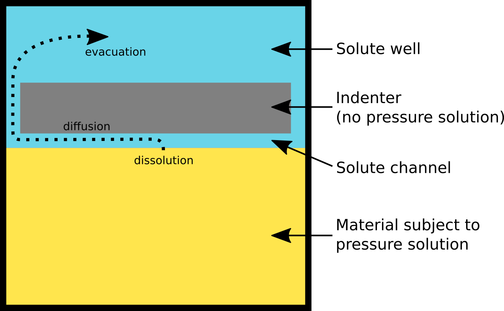

# PF_PS_Indentation

Phase-Field simulation of an indentation test in the case of pressure solution. It uses [MOOSE](https://github.com/idaholab/moose) software.  
This work is inspired by previous experiments presented in the following papers:

- JP Gratier (1993) Experimental pressure solution of Halite by an indenter technique. Geophysical Research Letters 20: 1647-1650
- JP Gratier, R Guiguet, R François, L Jenatton, D Bernard (2009) A pressure solution creep law for quartz from indentation experiments. Journal of Geophysical Research 114:B03403

The results are presented in the following reference: A Sac-Morane, H Rattez, M Veveakis (2025) Importance of the precipitation on the slowdown of the creep behavior due to pressure-solution. Journal of Engineering Mechanics 151:04025025

## Simulation presentation
The goal is to simulate the pressure solution phenomena (illustrated by the following scheme) between a grain and an indenter.

## Technical description

The goal of the phase-field step is to compute the shape of the grains as it evolves with the precipitation/dissolution.
An Allen-Cahn formulation is used coupled with a solute generation and diffusion. Hence, the conservation of the mass should be verified as precipitation/dissolution occurs.

The [phase-field theory](https://en.wikipedia.org/wiki/Phase-field_model) is based on the mesh of the sample and grains are represented by a phase variable (= 1 if the node is a grain, = 0 else). 

A [documentation](??) for the python script will be available soon.
